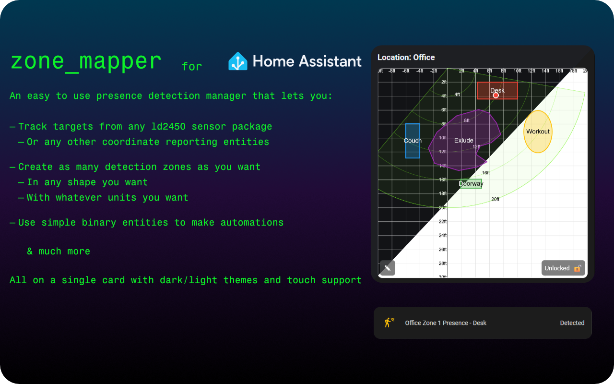

# Zone Mapper HACS Integration



Backend for the Zone Mapper Lovelace card. Persists zone definitions and exposes per‑zone occupancy sensors based on tracked X/Y entities.

> [!WARNING]
> This integration requires the Zone Mapper lovelace card for functionality. Install it from HACS or from [the repository.](https://github.com/ApolloAutomation/zone-mapper-card)

## Features

- Stores zone shapes and data as attributes on coordinate sensors (one per zone)
- Creates an occupancy binary_sensor for each zone
- Restores zones, tracked entities, and rotation after Home Assistant restarts
- Listens for and processes updates from the card via a single service
- Auto‑discovers and (re)loads platforms at startup based on existing entities

## Installation

There are two ways to install this integration. Both this integration and [the lovelace card](https://github.com/ApolloAutomation/zone-mapper-card) **must** be installed

### With HACS (Recommended)

HACS is like an app store for Home Assistant. It makes installing and updating custom integrations much easier. Here's how to install using HACS:

- **Install HACS if you don't have it:**

  - If HACS is not installed yet, download it following the instructions on [https://hacs.xyz/docs/use/download/download/](https://hacs.xyz/docs/use/download/download/)
  - Follow the HACS initial configuration guide at [https://hacs.xyz/docs/configuration/basic](https://hacs.xyz/docs/configuration/basic)

- **Add this custom repository to HACS:**

  - Go to `HACS` in your Home Assistant sidebar
  - CLick on the 3 dots in the upper right corner
  - Click "Custom repositories"
  - Add this URL to the repository: [https://github.com/ApolloAutomation/zone-mapper](https://github.com/ApolloAutomation/zone-mapper)
  - Select `Integration` for the type
  - Click the `ADD` button

- **Install Zone Mapper:**

  - Go to `HACS` in your Home Assistant sidebar
  - Search for `Zone Mapper` in HACS
  - Click on the card when you find it
  - Click the `Download` button at the bottom right
  - Repeat for lovelace card
  - Restart Home Assistant
  - Go to `Devices and Services`
  - Click `Add Integration`
  - Search `Zone Mapper`
  - Add `Zone Mapper`

### Manual Installation

1. Copy contents of ```custom_components``` folder to your Home Assistant custom components directory:

```text
/config/custom_components/zone_mapper
```

2. Add entry to your `configuration.yaml`:

```yaml
zone_mapper:
```

3. Restart Home Assistant.

4. Companion card: download `zone-mapper-card.js` from [the card repo](https://github.com/ApolloAutomation/zone-mapper-card) under `/config/www` and add it as a Dashboard Resource.

## Troubleshooting

- Service not found: confirm the integration is installed and `zone_mapper:` is present in configuration.yaml
- Zones don’t persist: check the coordinate sensor attributes; they should include `shape`, `data`, and `entities`, (and `rotation_deg` if set)
- Presence never turns on: verify tracked X/Y sensor states are numeric and confirm the point lies within the zone
- Entities missing after restart: draw zones once to initialize entity creation; subsequent restarts should restore automatically

## Entities created

Per location and zone (created on first update from the card):

- Coordinate sensor
  - Entity ID: `sensor.zone_mapper_<slug(location)>_zone_<id>`
  - Attributes: `shape`, `data`, `entities`, `rotation_deg`
  - Purpose: persists zone definition and tracks entities list for presence

- Presence binary sensor
  - Name: `<location> Zone <id> Presence`
  - Device class: `occupancy`
  - Purpose: turns on when any tracked target lies within the zone

> [!NOTE]
> - The card and backend use a Y‑down coordinate system (Y increases downward)
> - Presence math rotates tracked points by the stored `rotation_deg` so it matches the card’s rotated visuals
> - The `location` is normalized with Home Assistant's `slugify`, so punctuation and accents are stripped (e.g. `Living Room (Front)` → `living_room_front`)

## Persistence and startup

- On HA startup, the integration examines the entity registry to discover existing Zone Mapper sensors and loads platforms per location.
- Coordinate sensors restore their last attributes (zones, entities, rotation) and seed the in‑memory state to make presence work without user interaction.

## Service: zone_mapper.update_zone

Single service to create/update/clear zones and update rotation and entity lists.

Fields:

- `location` (string, required): Friendly location name used by the card and for entity ids
- `zone_id` (number, optional): Zone to update; omit for angle‑only update
- `shape` (optional): `none` | `rect` | `ellipse` | `polygon`
- `data` (optional): Shape payload (or null to clear)
- `rotation_deg` (number, optional): −180..180, updates per‑location rotation when provided
- `entities` (list, optional): Array of `{ x: <entity_id>, y: <entity_id> }` pairs for presence
- `name` (string, optional): Friendly name for the zone; updates entity friendly names
- `delete` (boolean, optional): When true, deletes the zone and removes its entities for this zone

Shape payloads:

- `rect`: `{ x_min, x_max, y_min, y_max }` (numeric; requires x_min < x_max and y_min < y_max)
- `ellipse`: `{ cx, cy, rx, ry }` (numeric; rx, ry > 0)
- `polygon`: `{ points: [ { x, y }, ... ] }` (3..32 points)

Behavior:

- Send `shape: none` or `data: null` to clear a zone.
- Provide only `rotation_deg` to update the device angle without changing any zone.
- Providing `entities` replaces the tracked list for the location, used by all zone presence sensors there.
- `name` updates the friendly names of the coordinate and presence entities for the zone.
- `delete: true` removes the zone and its entities. Rotation and entities are location‑wide and can be updated without `zone_id`.

Examples

Clear zone 1:

```yaml
service: zone_mapper.update_zone
data:
  location: Office
  zone_id: 1
  shape: none
  data: null
```

Update rotation only:

```yaml
service: zone_mapper.update_zone
data:
  location: Office
  rotation_deg: 30
```

Create/update a polygon:

```yaml
service: zone_mapper.update_zone
data:
  location: Office
  zone_id: 2
  shape: polygon
  data:
    points:
      - { x: -500, y: 400 }
      - { x: 300,  y: 600 }
      - { x: 0,    y: 1200 }
```

Rename a zone:

```yaml
service: zone_mapper.update_zone
data:
  location: Office
  zone_id: 1
  name: "Entryway"
```

Delete a zone and its entities:

```yaml
service: zone_mapper.update_zone
data:
  location: Office
  zone_id: 1
  delete: true
```

## Development notes

- Platforms: `sensor` (coordinates storage) and `binary_sensor` (presence)
- Event bus: fires `zone_mapper_zone_updated` to notify platform entities of changes
- Constants and limits are defined in `const.py` (e.g., `POLYGON_MAX_POINTS = 32`)

